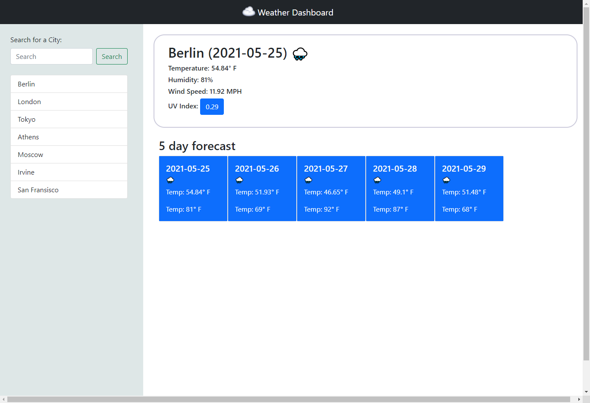

# WeatherReport

A website that uses OpenWeather API to display information about weather in different cities! It takes in a user's input for a city name then displays various weather related information about the city as well as a 5 day forecast.

I used Bootstrap's style library to create the appearence of this page. Bootstrap is definitely my go-to library if I need to get something done in a reasonable amount of time!

I had a hard time working with the API for this project. I know I'll get better at it once I know what problems to look out for though!

The following image demonstrates the application functionality:

